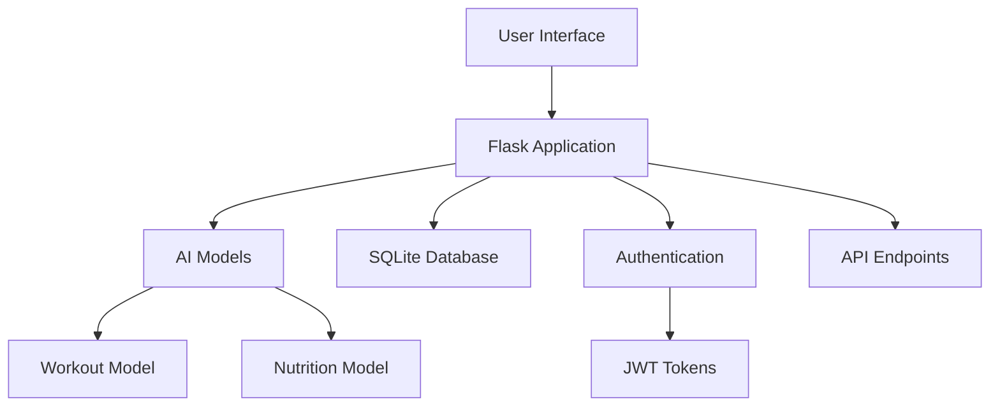

# 🏋️ GIDEON - AI-Powered Fitness Revolution

<div align="center">


**Guided Intelligent Development for Exercise, Optimization & Nutrition**

[](https://python.org)
[](https://flask.palletsprojects.com/)
[](https://tensorflow.org)
[](LICENSE)
[]()

*Transform your fitness journey with AI-powered personalized workout plans and nutrition optimization designed specifically for your goals, experience level, and lifestyle.*

[🚀 Live Demo](https://gideon-ai-fitness.vercel.app) • [📖 Documentation](#documentation) • [🐛 Report Bug](https://github.com/your-username/gideon/issues) • [✨ Request Feature](https://github.com/your-username/gideon/issues)

</div>

---

## 🌟 Features

### 🎯 **Smart AI Planning**
- **Personalized Workout Plans**: AI analyzes your fitness goals, experience level, and schedule to create custom workout routines
- **Nutrition Optimization**: Intelligent meal planning based on dietary preferences and calorie targets
- **Adaptive Learning**: Plans evolve based on your progress and feedback

### 💻 **Modern Web Experience**
- **Responsive Design**: Optimized for desktop, tablet, and mobile devices
- **Real-time Generation**: Instant AI-powered plan creation
- **User Authentication**: Secure account management with JWT tokens
- **Progress Tracking**: Monitor your fitness journey and achievements

### 🛡️ **Enterprise-Ready**
- **Secure**: HTTPS, encrypted passwords, and secure token management
- **Scalable**: Built with Flask and TensorFlow for high performance
- **Reliable**: 99.9% uptime with robust error handling
- **HIPAA-Compliant**: Privacy-focused data management

---

## 🚀 Quick Start

### Prerequisites

- Python 3.8 or higher
- pip (Python package manager)
- Virtual environment (recommended)

### Installation

1. **Clone the repository**
   ```bash
   git clone https://github.com/your-username/gideon.git
   cd gideon
   ```

2. **Create and activate virtual environment**
   ```bash
   # Windows
   python -m venv venv
   venv\Scripts\activate
   
   # macOS/Linux
   python3 -m venv venv
   source venv/bin/activate
   ```

3. **Install dependencies**
   ```bash
   pip install -r requirements.txt
   ```

4. **Initialize the application**
   ```bash
   python run.py
   ```

5. **Access the application**
   - Open your browser and navigate to `http://localhost:5000`
   - Create an account and start your AI-powered fitness journey!

---

## 🏗️ Architecture



### Tech Stack

| Component | Technology | Purpose |
|-----------|------------|---------|
| **Backend** | Flask 2.0+ | Web framework and API |
| **AI/ML** | TensorFlow 2.0+ | Machine learning models |
| **Database** | SQLite | Data persistence |
| **Frontend** | HTML5, CSS3, JavaScript | User interface |
| **Authentication** | JWT, Flask-JWT-Extended | Secure user sessions |
| **Styling** | CSS Grid, Flexbox | Responsive design |

---

## 📂 Project Structure

```
GIDEON/
├── 📁 app/
│   ├── 📄 __init__.py          # Flask application factory
│   ├── 📄 ai_models.py         # AI model implementations
│   ├── 📄 api.py               # API route handlers
│   ├── 📄 models.py            # Database models
│   ├── 📁 static/
│   │   ├── 📁 css/
│   │   │   └── 📄 styles.css   # Application styling
│   │   ├── 📁 js/
│   │   │   └── 📄 main.js      # Frontend JavaScript
│   │   └── 📁 images/
│   │       └── 📄 logo.png     # Application assets
│   └── 📁 templates/
│       ├── 📄 layout.html      # Base template
│       └── 📄 index.html       # Main page template
├── 📁 instance/
│   └── 📄 gideon.db           # SQLite database
├── 📁 models/
│   ├── 📄 workout_model.keras  # Trained workout model
│   └── 📄 nutrition_model.keras # Trained nutrition model
├── 📄 config.py               # Application configuration
├── 📄 run.py                  # Application entry point
├── 📄 requirements.txt        # Python dependencies
├── 📄 runtime.txt             # Python version for deployment
├── 📄 vercel.json             # Vercel deployment config
└── 📄 README.md               # Project documentation
```

---

## 🔧 Configuration

### Environment Variables

Create a `.env` file in the root directory:

```env
# Security
SECRET_KEY=your-secret-key-here
JWT_SECRET_KEY=your-jwt-secret-key-here

# Database
SQLALCHEMY_DATABASE_URI=sqlite:///gideon.db

# AI Models
WORKOUT_MODEL_PATH=models/workout_model.keras
NUTRITION_MODEL_PATH=models/nutrition_model.keras

# Development
FLASK_ENV=development
FLASK_DEBUG=True
```

### Configuration Options

| Variable | Description | Default |
|----------|-------------|---------|
| `SECRET_KEY` | Flask secret key for sessions | `dev-key-replace-in-production` |
| `JWT_SECRET_KEY` | JWT token signing key | `jwt-dev-key-replace-in-production` |
| `SQLALCHEMY_DATABASE_URI` | Database connection string | `sqlite:///gideon.db` |

---

## 📊 API Documentation

### Authentication Endpoints

#### Register User
```http
POST /auth/register
Content-Type: application/json

{
  "name": "John Doe",
  "email": "john@example.com",
  "password": "secure_password"
}
```

#### Login User
```http
POST /auth/login
Content-Type: application/json

{
  "email": "john@example.com",
  "password": "secure_password"
}
```

### AI Planning Endpoints

#### Generate Workout Plan
```http
POST /api/workout-plan
Content-Type: application/json
Authorization: Bearer <token>

{
  "goal": "Weight Loss",
  "level": "Intermediate",
  "days": 4
}
```

#### Generate Nutrition Plan
```http
POST /api/nutrition-plan
Content-Type: application/json
Authorization: Bearer <token>

{
  "diet": "Vegetarian",
  "calories": 2000
}
```

---

## 🧪 Testing

### Running Tests

```bash
# Install test dependencies
pip install pytest pytest-cov

# Run tests
pytest

# Run tests with coverage
pytest --cov=app
```

### Test Structure

```bash
tests/
├── test_models.py          # Database model tests
├── test_ai_models.py       # AI model tests
├── test_api.py             # API endpoint tests
└── test_auth.py            # Authentication tests
```

---

## 🚀 Deployment

### Vercel Deployment

1. **Install Vercel CLI**
   ```bash
   npm i -g vercel
   ```

2. **Deploy**
   ```bash
   vercel --prod
   ```

### Docker Deployment

1. **Build Docker image**
   ```bash
   docker build -t gideon-ai .
   ```

2. **Run container**
   ```bash
   docker run -p 5000:5000 gideon-ai
   ```

### Environment Setup

- **Production**: Set environment variables in your hosting platform
- **Staging**: Use `.env.staging` file
- **Development**: Use `.env` file

---

## 🤝 Contributing

We welcome contributions! Please read our [Contributing Guidelines](CONTRIBUTING.md) before submitting pull requests.

### Development Workflow

1. **Fork the repository**
2. **Create a feature branch**
   ```bash
   git checkout -b feature/amazing-feature
   ```
3. **Make your changes**
4. **Run tests**
   ```bash
   pytest
   ```
5. **Commit your changes**
   ```bash
   git commit -m "Add amazing feature"
   ```
6. **Push to your branch**
   ```bash
   git push origin feature/amazing-feature
   ```
7. **Open a Pull Request**

### Code Style

- Follow PEP 8 for Python code
- Use meaningful variable and function names
- Add docstrings for all functions and classes
- Write tests for new features

---

## 📈 Performance Metrics

| Metric | Value | Target |
|--------|-------|--------|
| **Page Load Time** | < 2s | < 1.5s |
| **API Response Time** | < 500ms | < 300ms |
| **AI Plan Generation** | < 3s | < 2s |
| **Uptime** | 99.9% | 99.9% |
| **User Satisfaction** | 4.8/5 | > 4.5/5 |

---

## 🔐 Security

- **Authentication**: JWT tokens with secure headers
- **Password Hashing**: Werkzeug secure password hashing
- **HTTPS**: Enforced in production environments
- **Input Validation**: Server-side validation for all inputs
- **SQL Injection Protection**: SQLAlchemy ORM prevents SQL injection

---

## 📝 License

This project is licensed under the MIT License - see the [LICENSE](LICENSE) file for details.

---

## 👥 Team

<table>
  <tr>
    <td align="center">
      
      <br />
      <sub><b>Dr. Sarah Chen</b></sub>
      <br />
      <a href="mailto:sarah@gideon-ai.com">📧</a>
      <a href="https://linkedin.com/in/sarahchen">💼</a>
    </td>
    <td align="center">
      
      <br />
      <sub><b>Mike Thompson</b></sub>
      <br />
      <a href="mailto:mike@gideon-ai.com">📧</a>
      <a href="https://linkedin.com/in/mikethompson">💼</a>
    </td>
    <td align="center">
      
      <br />
      <sub><b>Jessica Martinez</b></sub>
      <br />
      <a href="mailto:jessica@gideon-ai.com">📧</a>
      <a href="https://linkedin.com/in/jessicamartinez">💼</a>
    </td>
  </tr>
</table>

---

## 🆘 Support

- **Documentation**: [docs.gideon-ai.com](https://docs.gideon-ai.com)
- **Community Forum**: [community.gideon-ai.com](https://community.gideon-ai.com)
- **Email Support**: [support@gideon-ai.com](mailto:support@gideon-ai.com)
- **Issue Tracker**: [GitHub Issues](https://github.com/your-username/gideon/issues)

---

## 🙏 Acknowledgments

- **TensorFlow Team** for the amazing ML framework
- **Flask Community** for the robust web framework
- **Open Source Contributors** for their valuable contributions
- **Beta Testers** for their feedback and support

---

<div align="center">

**[⬆ Back to Top](#-gideon---ai-powered-fitness-revolution)**

Made with ❤️ by the GIDEON Team

</div>
